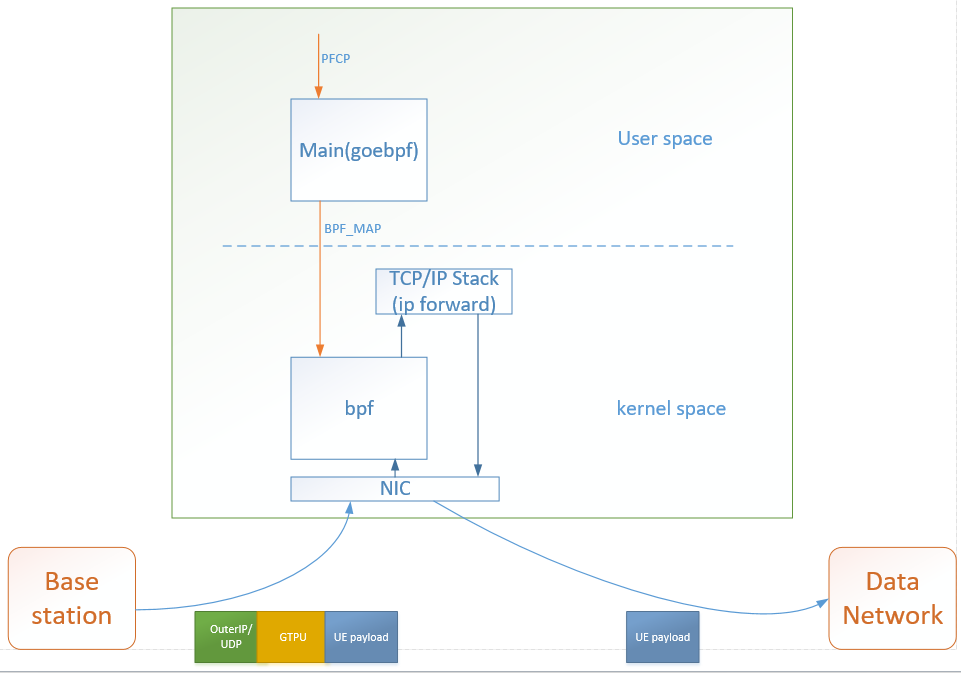

# upf-xdp
This program uses xdp to simply process gtpu packet.
 It is just a toy, but it shows the possibility of using xdp to implement 5g upf.
## Setup dependencies
[libbpf]https://github.com/libbpf/libbpf
 [goebpf]https://github.com/dropbox/goebpf
## Component

## discuss
Message routing can be forwarded directly through the xdp encapsulation layer 2 Ethernet frame without going through the protocol stack. 
 What is the number of tables supported by xdp?